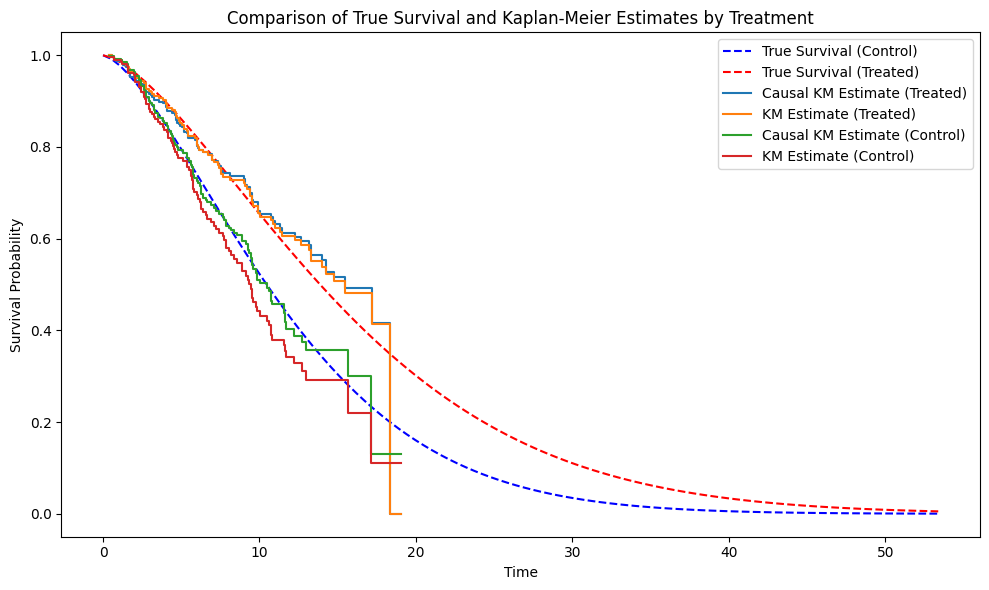

# Non-Parametric Estimator Modification for Survival Analysis

This repository contains a modification of a classical non-parametric estimator in survival analysis: the Kaplan-Meier estimator. Two causal adaptations of this estimator are implemented, inspired by the article: [[Causal survival analysis
Estimation of the Average Treatment Effect (ATE): Practical Recommendations](https://arxiv.org/pdf/2501.05836)].

### Overview

The two causal adaptations are based on:
1. **Conditional Survival Function of the Censoring**: The probability of being censored given covariates.
2. **Propensity Score**: The probability of receiving the treatment given covariates.

Both quantities must satisfy the following assumption:

### Assumption
**Positivity / Overlap for Censoring**  
There exists ε > 0 such that for all t ∈ [0, τ), it almost surely holds:  
G(t | A, X) ⩾ ε.

### Choosing the Right Estimator

To determine which estimator is most suitable for your use case, refer to the table below:

| **Scenario**                                      | **Kaplan-Meier (Classical)** | **Causal IPCW-Kaplan-Meier (Censoring)** | **Causal IPTW-Kaplan-Meier (Propensity)** | **Causal IPTW-IPCW-Kaplan-Meier (Propensity & Censoring)** |
|---------------------------------------------------|------------------------------|------------------------------------------|------------------------------------------|----------------------------------------------------------|
| RCT (Censoring & Treatment independent of covariates) | ✅                           | ✅                                       | ✅                                       | ✅                                                       |
| Censoring dependent on covariates                | ❌                           | ✅                                       | ❌                                       | ✅                                                       |
| Treatment dependent on covariates                | ❌                           | ❌                                       | ✅                                       | ✅                                                       |
| Treatment and Censoring dependent on covariates  | ❌                           | ❌                                        | ❌                                       | ✅                                                       |

