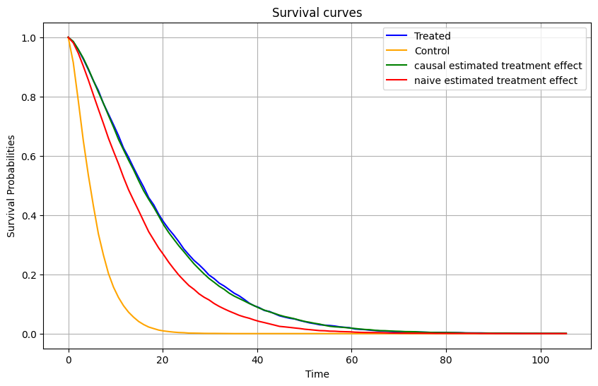

# Non-Parametric Estimator Modification for Causal Survival Analysis

This repository contains a modification of a classical non-parametric estimator in survival analysis: the Kaplan-Meier estimator. Two causal adaptations of this estimator are implemented, inspired by the article: [[Causal survival analysis
Estimation of the Average Treatment Effect (ATE): Practical Recommendations](https://arxiv.org/pdf/2501.05836)].

### Overview

The two causal adaptations are based on:
1. **Conditional Survival Function of the Censoring**: The probability of being censored given covariates.
2. **Propensity Score**: The probability of receiving the treatment given covariates.

Both quantities must satisfy the following assumption:

### Assumption
**Positivity / Overlap for Censoring**  
There exists ε > 0 such that for all t ∈ [0, τ), it almost surely holds:  
G(t | A, X) ⩾ ε.

### Choosing the Right Estimator

To determine which estimator is most suitable for your use case, refer to the table below:

| **Scenario**                                      | **Kaplan-Meier (Classical)** | **Causal IPCW-Kaplan-Meier (Censoring)** | **Causal IPTW-Kaplan-Meier (Propensity)** | **Causal IPTW-IPCW-Kaplan-Meier (Propensity & Censoring)** |
|---------------------------------------------------|------------------------------|------------------------------------------|------------------------------------------|----------------------------------------------------------|
| RCT (Censoring & Treatment independent of covariates) | ✅                           | ✅                                       | ✅                                       | ✅                                                       |
| Censoring dependent on covariates                | ❌                           | ✅                                       | ❌                                       | ✅                                                       |
| Treatment dependent on covariates                | ❌                           | ❌                                       | ✅                                       | ✅                                                       |
| Treatment and Censoring dependent on covariates  | ❌                           | ❌                                        | ❌                                       | ✅                                                       |

# Estimation of Average Treatment Effect on Survival Time

This code estimates the **Average Treatment Effect on Survival Time** :

**Causal Effect: Difference between Restricted Mean Survival Time (RMST)**  
θRMST = E[T(1) ∧ τ − T(0) ∧ τ],  
where `a ∧ b := min(a, b)` for `a, b ∈ R`.

The expectation is defined as:  
E[T(a) ∧ τ] = ∫0∞ P(T(a) ∧ τ > t) dt = ∫0τ Sa(t) dt,  
where `a` is the applied treatment.

## Functionality

The `calculate_causal_effect` function computes the quantity θRMST. It allows users to:

- Select covariates to include in the model.
- Choose the type of model to predict:
  - **Propensity scores**.
  - **Censoring probabilities**.
- Configure model characteristics.

## Key Insights

1. **Unbiased Estimation**:  
   The `IPTW_IPCW` estimator is unbiased for estimating the average treatment effect, unlike the naive estimation. This is demonstrated in the provided graph.

2. **Predicting Survival Curves**:  
   Knowing the treatment effect enables the prediction of survival curves for individuals under specific treatments. The figures illustrate how treatment can either increase or decrease individuals' survival times.

## Visualizations

- **Comparison of Estimators**: A graph showing the unbiased nature of the `IPTW_IPCW` estimator compared to naive estimation.
  

- **Survival Curves**: Figures demonstrating the predicted survival curves under different treatment scenarios.
  
  

